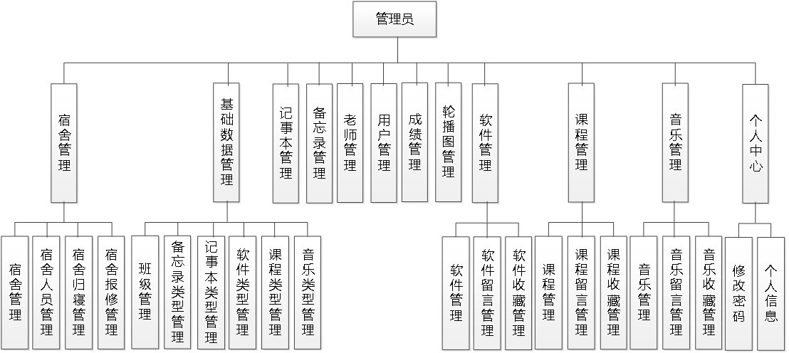
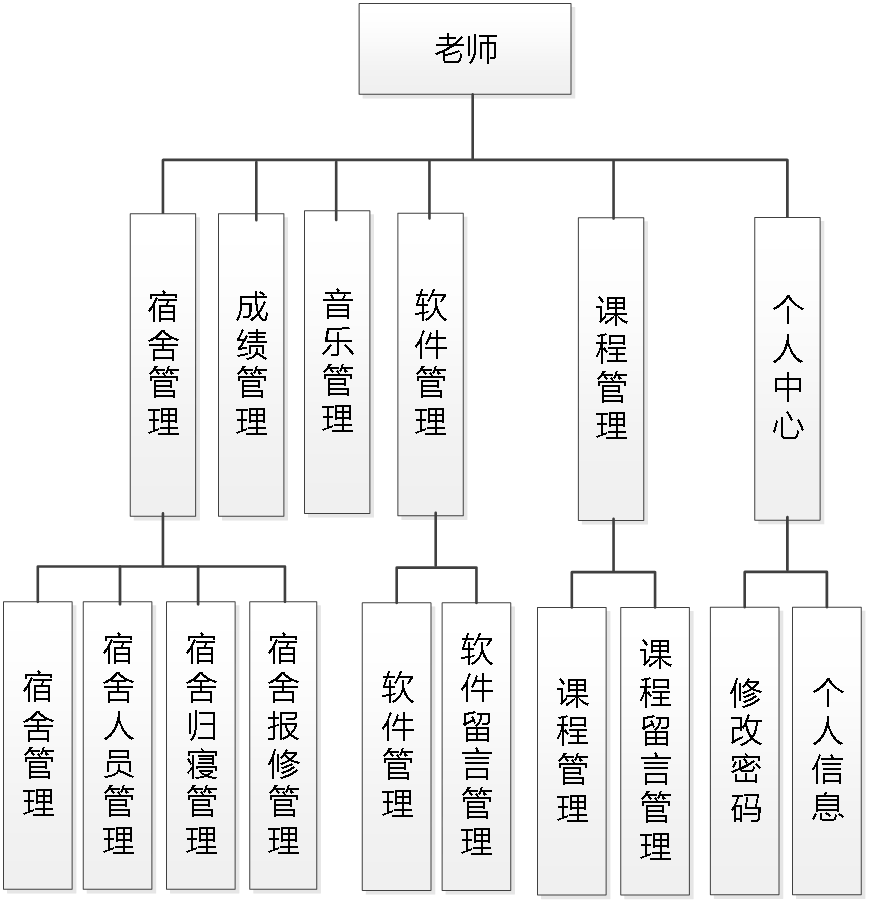
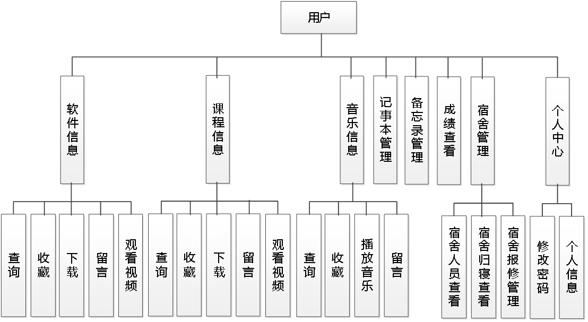
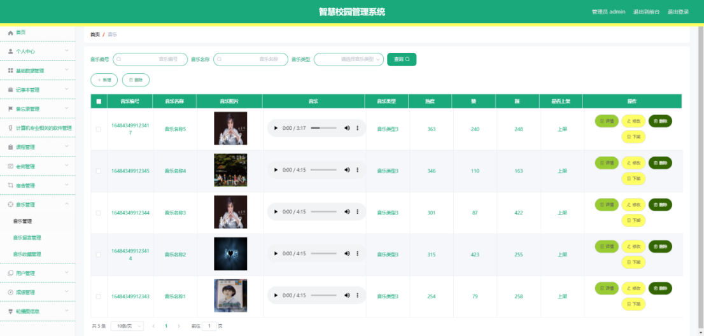
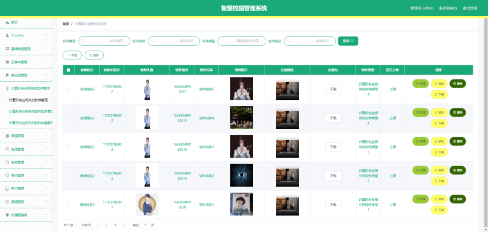
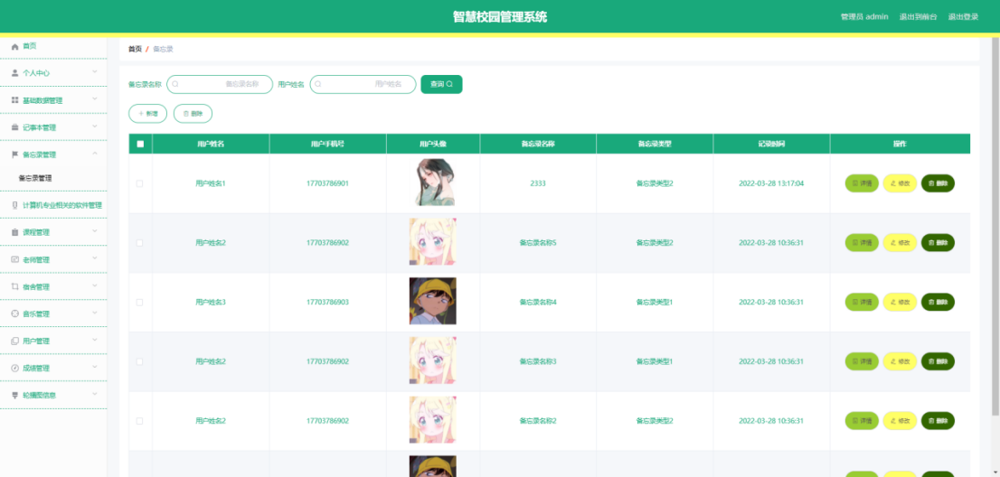
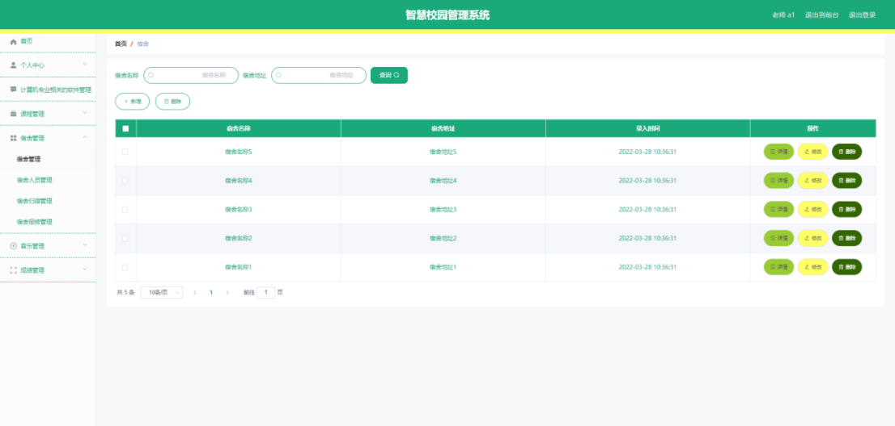
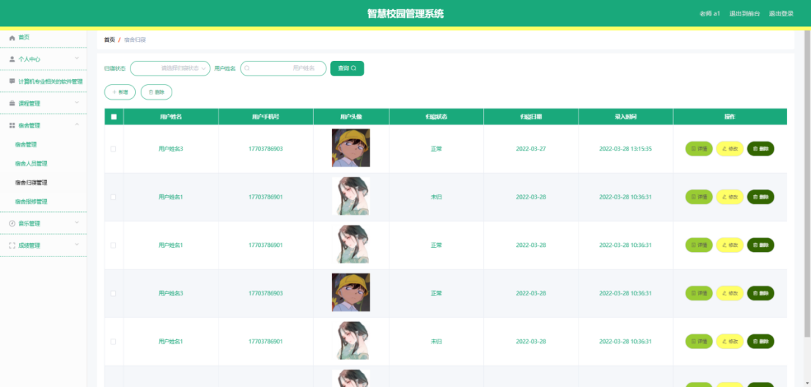
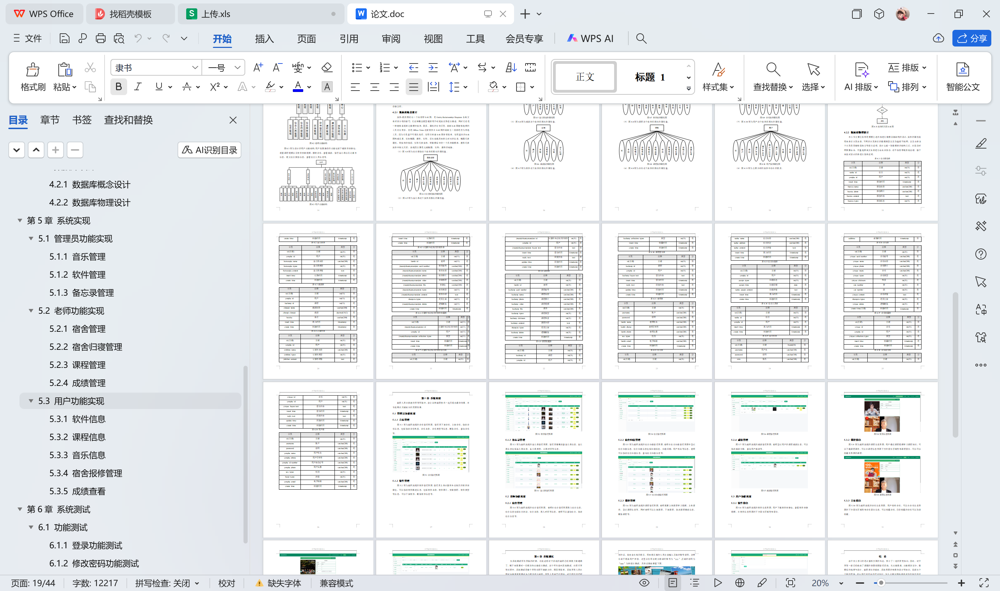

# springboot194-智慧校园管理系统设计与开发

>  博主介绍：
>  Hey，我是程序员Chaers，一个专注于计算机领域的程序员
>  十年大厂程序员全栈开发‍ 日常分享项目经验 解决技术难题与技术推荐 承接各类网站设计，小程序开发，毕设等。
>  【计算机专业课程设计，毕业设计项目，Java，微信小程序，安卓APP都可以做，不仅仅是计算机专业，其它专业都可以】

## 3000套系统可挑选，获取链接：https://chaerspol.github.io/

<b>QQ【获取完整源码】：674456564</b>

<b>QQ群【获取完整源码】：1058861570</b>

### 系统架构

> 前端：html | js | css | jquery | vue
>
> 后端：springboot | mybatis
> 
> 环境：jdk1.8+ | mysql | maven

# 一、内容包括
包括有  项目源码+项目论文+数据库源码+答辩ppt+远程调试成功

# 二、运行环境

> jdk版本：1.8 及以上； ide工具：IDEA； 数据库: mysql5.7及以上；编程语言: Java

# 三、需求分析

**3.1 可行性分析**

从三个不同的角度来分析，确保开发成功的前提是有可行性分析，只有进行提前分析，符合程序开发流程才不至于开发过程的中断。

**3.1.1 技术可行性**

在技术实现层次，分析了好几种技术实现方法，并且都有对应的成功案例，也有很多开源模块可以进行参考，所以从技术可行性分析来讲，实现智慧校园管理系统是没有问题的。

**3.1.2 经济可行性**

对于身为学生的开发者而言，在经济资源上面可用者很少，为了开发智慧校园管理系统，通过开发软件对硬件的要求，发现自己的电脑是完全能用来开发的，并且学校机房的配置也可以达到要求。最重要的是选择的技术都可以在网上找到不花钱的教程以及资料，因为不花钱，所以经济方面是具有可行性的。

**3.1.3 操作可行性**

智慧校园管理系统的具体实现，本身参考人类的正常操作逻辑，把常用的操作习惯当做主要的导航实现，可以让使用者更快速的理解并且上手操作，实现符合逻辑的操作流程是操作可行性的具体体现。
以上就是从不同的角度来分析，确保了智慧校园管理系统的正常开展。

**3.2 系统流程**

智慧校园管理系统投入使用后，使用者如果能看到相应的流程操作图会提高程序的理解能力。
使用者在操作智慧校园管理系统中，应该按照本系统提供的操作流程（图3.1即为本系统的操作流程图）进行操作，可以减少操作失误，从而节省进入智慧校园管理系统的时间。

# 四、功能模块

下图即为设计的管理员功能结构，管理员权限操作的功能包括管理记事本，管理备忘录，管理软件，管理课程，管理音乐，管理宿舍，管理成绩，管理老师等。

下图即为设计的老师功能结构，老师权限操作的功能包括管理成绩，管理宿舍，管理宿舍归寝，管理宿舍报修，管理音乐，管理软件等。

下图即为设计的用户功能结构，用户权限操作的功能包括下载软件安装包，观看课程视频以及软件安装视频，播放音乐，查看成绩，管理备忘录以及记事本信息，提交宿舍报修信息，查看宿舍人员信息等。

# 五、效果图展示【部分效果图】

图5.1 音乐管理界面【图5.1 即为编码实现的音乐管理界面，管理员下架音乐，上架音乐，修改音乐信息，包括修改音乐热度，音乐名称，音乐类型等信息，删除音乐，查询音乐等。】

图5.2 软件管理界面【图5.2 即为编码实现的软件管理界面，管理员上传计算机专业相关的软件安装包，可以修改软件描述信息，包括软件名称，软件照片，安装教程，软件类型等信息，可以下架软件，删除软件信息等。】

图5.3 备忘录管理界面【图5.3 即为编码实现的备忘录管理界面，管理员增删改查备忘录信息，备忘录信息包括备忘录名称，备忘录类型，记录时间等信息。】

图5.4 宿舍管理界面【图5.4 即为编码实现的宿舍管理界面，老师在宿舍管理界面录入宿舍信息，宿舍信息包括宿舍地址，宿舍名称，录入时间等信息，老师可以查询宿舍，修改宿舍信息等。】

图5.5 宿舍归寝管理界面【图5.5 即为编码实现的宿舍归寝管理界面，老师在宿舍归寝管理界面中登记宿舍归寝信息，宿舍归寝信息包括归寝状态，归寝日期，用户姓名等信息，老师可以修改宿舍归寝信息，查询宿舍归寝信息等。】

 <b>完整文章</b>
 

 

## 3000套系统可挑选，获取链接：https://chaerspol.github.io/

<b>QQ【获取完整源码】：674456564</b>

<b>QQ群【获取完整源码】：1058861570</b>

